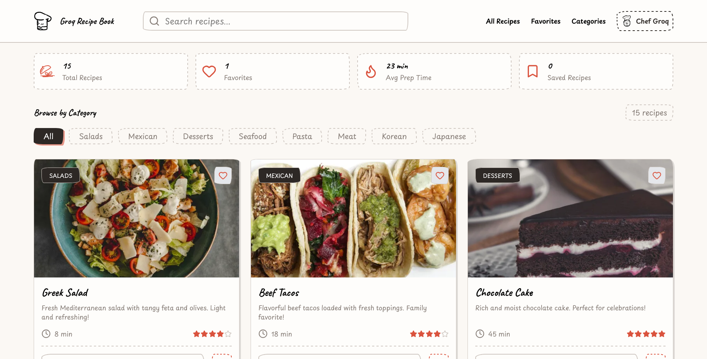
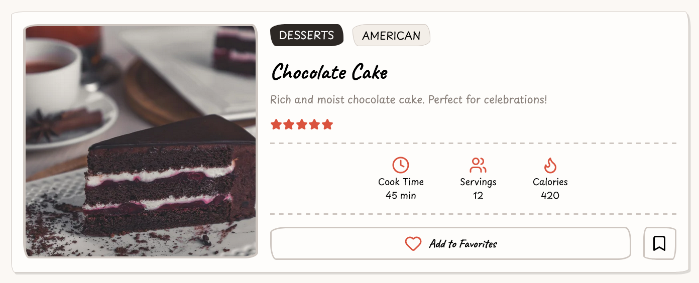
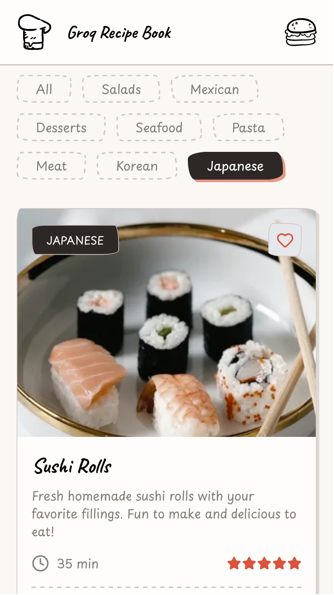

# 
# 📖 Groq Recipe Book

> Your personal recipe collection. Store, organize, and discover delicious recipes by Chef Groq.

A modern, responsive recipe management application built with React. Browse recipes by category, search by name, adjust serving sizes dynamically, and keep track of your favorites!


---

## ✨ Features

- 🍳 **15+ Curated Recipes** - Diverse collection from Greek Salad to Sushi Rolls
- 🔍 **Smart Search** - Find recipes by name instantly with real-time filtering
- 🏷️ **Category Filters** - Browse by Pasta, Seafood, Salads, Meat, Desserts, Mexican, Korean, Japanese
- ⚖️ **Dynamic Serving Adjustment** - Scale ingredient amounts automatically based on servings
- ⭐ **Favorites System** - Mark and filter your favorite recipes
- 📱 **Fully Responsive** - Seamless experience on desktop, tablet, and mobile
- 💾 **Persistent Storage** - LocalStorage integration keeps your data between sessions
- 🎨 **Beautiful UI** - Clean, modern design with smooth animations
- ♿ **Accessible** - Built with WCAG accessibility guidelines
- 📋 **Interactive Ingredients** - Check off ingredients as you cook
- 📊 **Nutrition Information** - View nutritional data for each recipe
- 💡 **Cooking Tips** - Expert tips included with every recipe
- 🌐 **SEO Optimized** - Meta tags and structured data for better discoverability

---

## 🚀 Live Demo

**[View Live Demo](https://groq-recipe-book.vercel.app)**

---

## 📸 Screenshots

### Home Page
Browse recipes by category with beautiful card layouts


### Recipe Detail View
Detailed instructions, ingredients with serving adjustments, and nutrition info


### Mobile Responsive
Full functionality on any device


---

## 🛠️ Tech Stack

### Core
- **React 18.3** - Modern UI library with hooks
- **Vite 5.0** - Lightning-fast build tool and dev server
- **JavaScript ES6+** - Modern JavaScript features

### Styling
- **Tailwind CSS 3.4** - Utility-first CSS framework
- **Custom CSS** - Additional styling and animations

### State Management
- **React Context API** - Global state management
- **useImmerReducer** - Immutable state updates with Immer
- **LocalStorage API** - Client-side data persistence

### UI/UX
- **Tippy.js** - Elegant tooltips and popovers
- **Custom Hooks** - Reusable React logic

---

## 📋 Prerequisites

Before you begin, ensure you have:

- **Node.js** (v18.0.0 or higher)
- **npm** (v9.0.0 or higher) or **yarn**

---

## 🔧 Installation & Setup

### 1. Clone the repository
```bash
git clone https://github.com/aymansoliman-dev/GroqRecipeBook.git
aymansoliman-dev GroqRecipeBook
```

### 2. Install dependencies
```bash
npm install
```

### 3. Start development server
```bash
npm run dev
```

### 4. Open in browser
Navigate to `http://localhost:5173`

---

## 📦 Available Scripts
```bash
# Start development server
npm run dev

# Build for production
npm run build

# Preview production build
npm run preview

# Lint code
npm run lint
```

---

## 🎯 Usage Guide

### Browsing Recipes
1. Browse all recipes on the home page
2. Click category filters (Pasta, Seafood, Salads, etc.) to filter by cuisine
3. Use the search bar to find specific recipes by name, cuisine, category, or even ingredient
4. Click on "Cook Now" button in any recipe card to view full details

### Viewing Recipe Details
1. Click "Cook Now" on any recipe card
2. See complete ingredient list with amounts
3. Read step-by-step instructions
4. View nutrition information and cooking tips
5. Click the ✕ button or press `Escape` to close

### Adjusting Servings
1. Open any recipe detail page
2. Find the "Adjust Servings" section
3. Use **-** and **+** buttons to decrease or increase servings
4. Watch ingredient amounts scale automatically
5. Original serving count is shown for reference

### Managing Favorites
1. Click the **❤️** (heart) icon on any recipe card
2. Toggle on/off to add/remove from favorites
3. Click the "Favorites" filter to view only favorited recipes

### Checking Off Ingredients
1. While viewing a recipe, check ingredient checkboxes as you gather them
2. Track your progress while cooking
3. Checkboxes reset when you reopen the recipe

---

## 🗂️ Project Structure
````
aymansoliman-dev
GroqRecipeBook/
│
├── public/
│   ├── robots.txt              # SEO crawler instructions
│   └── favicon files           # App icons
│  
├── src/
│   ├── assets/
│   │   └── asset.svg           # Every svg icon used in the App
│   │
│   ├── components/
│   │   ├── Advertisement.jsx   # Recommending Chef Groq App
│   │   ├── AIChefAssistant.jsx # Link to Chef Groq App
│   │   ├── CategoryBrowser.jsx # Category filter buttons
│   │   ├── Footer.jsx          # App footer
│   │   ├── Header.jsx          # App header with branding
│   │   ├── Logo.jsx            # Reusable logo component
│   │   ├── MainContent.jsx     # Main content wrapper
│   │   ├── NavigationBar.jsx   # App navbar
│   │   ├── RecipeCard.jsx      # Individual recipe card
│   │   ├── RecipePage.jsx      # Full recipe detail modal
│   │   ├── RecipesGrid.jsx     # Recipe cards grid layout
│   │   ├── SearchBar.jsx       # Recipe search input
│   │   ├── Stat.jsx            # Reusable individual stat component
│   │   └── Stats.jsx           # Stas of your recipes
│   │
│   ├── context/
│   │   └── RecipesProvider.jsx # Global state with Context + Reducer
│   │
│   ├── data/
│   │   └── state.js            # Recipe database (15 recipes)
│   │
│   ├── App.css                 # App styles
│   ├── App.jsx                 # Root component
│   └── main.jsx                # App entry point 
│
├── .gitignore                   # Git ignore rules
├── index.html                   # HTML entry point with meta tags
├── vite.config.js               # Vite configuration
├── package.json                 # Dependencies and scripts
├── LICENSE                      # MIT License
└── README.md                    # This file
````

---

## 🎨 Key Features Explained

### State Management Architecture
The app uses React Context API with `useImmerReducer` for predictable, immutable state updates:
```javascript
// Reducer actions
- viewed_recipe_page // Open recipe detail
- hid_recipe_page    // Close recipe detail
- toggled_favorite   // Toggle favorite status
- selected_category  // Update category filter
- searched           // Update search query
```

### Dynamic Ingredient Scaling
Ingredients are structured as objects with precise measurements:
```javascript
{
  name: "all-purpose flour",
  amount: 2,
  unit: "cups"
}
```

When servings are adjusted, amounts scale proportionally:
- **Base:** 2 servings, 2 cups flour
- **Scaled to 4:** 4 cups flour
- **Scaled to 1:** 1 cup flour

### LocalStorage Persistence
All state is automatically saved to browser localStorage:
- Recipes and their favorite status
- User preferences
- Filter and search state (optional)

Data persists across browser sessions and page refreshes.

### Accessibility Features
- Semantic HTML elements (`<article>`, `<section>`, `<nav>`)
- ARIA labels for icon buttons
- Keyboard navigation support (Escape to close modals)
- Focus management
- Screen reader friendly

---

## 🧪 Recipe Data Structure

Each recipe contains:
```javascript
{
  id: 0,
  name: "greek salad",
  image: "https://...",
  category: "salads",
  cuisine: "greek",
  difficultyLevel: "easy",
  servings: 2,
  ingredients: [
    { name: "cucumber", amount: 2, unit: "large" },
    { name: "salt", amount: null, unit: "to taste" }
  ],
  description: "Fresh Mediterranean salad...",
  prepTime: 8,
  rating: 4,
  instructions: ["Step 1...", "Step 2..."],
  nutritionInfo: {
    calories: 180,
    protein: "6g",
    carbs: "12g",
    fat: "12g",
    fiber: "3g"
  },
  tips: ["Tip 1...", "Tip 2..."],
  isFavorite: false,
  isSaved: false
}
```

---

## 🤝 Contributing

Contributions are welcome! Here's how you can help:

### Reporting Bugs
1. Check if the bug is already reported in [Issues](https://github.com/aymansoliman-dev/GroqRecipeBook/issues)
2. Open a new issue with:
    - Clear title and description
    - Steps to reproduce
    - Expected vs actual behavior
    - Screenshots if applicable

### Suggesting Features
1. Open an issue with the `enhancement` label
2. Describe the feature and its benefits
3. Discuss implementation approach

### Pull Requests
1. Fork the repository
2. Create a feature branch (`git checkout -b feature/AmazingFeature`)
3. Make your changes
4. Commit with clear messages (`git commit -m 'Add some AmazingFeature'`)
5. Push to your branch (`git push origin feature/AmazingFeature`)
6. Open a Pull Request

### Code Style
- Follow existing code formatting
- Use meaningful variable and function names
- Add comments for complex logic
- Ensure no console errors or warnings

---

## 🐛 Known Issues

Currently, there are no known issues! 🎉

If you find a bug, please [report it](https://github.com/aymansoliman-dev/GroqRecipeBook/issues).

---

## 🔮 Roadmap & Future Enhancements

### Short Term
- [ ] Add recipe creation form
- [ ] Edit existing recipes in-app
- [ ] Delete recipes
- [ ] Recipe categories management
- [ ] Improved mobile navigation

### Medium Term
- [ ] Export recipes as PDF
- [ ] Print-friendly recipe view
- [ ] Share recipes via link/QR code
- [ ] Recipe import from URL
- [ ] Shopping list generator from selected recipes
- [ ] Meal planning calendar
- [ ] Recipe notes and personal modifications

### Long Term
- [ ] User authentication (Firebase/Supabase)
- [ ] Cloud sync across devices
- [ ] Recipe ratings and reviews
- [ ] Community recipe sharing
- [ ] AI-powered recipe generation (Groq API integration)
- [ ] Image upload for custom recipes
- [ ] Video cooking instructions
- [ ] Voice-guided cooking mode
- [ ] Multi-language support (i18n)
- [ ] Dark mode toggle
- [ ] Advanced filtering (dietary restrictions, prep time, difficulty)
- [ ] Ingredient substitution suggestions
- [ ] Nutritional goals tracking
- [ ] Weekly meal prep planner

---

## 🌐 Deployment

### Deploy to Vercel

1. Push your code to GitHub
2. Visit [vercel.com](https://vercel.com)
3. Import your repository
4. Vercel auto-detects Vite configuration
5. Click "Deploy"

### Manual Deployment
```bash
# Build production files
npm run build

# The dist/ folder contains your production files
# Upload to any static hosting service
```

---

## 📄 License

This project is licensed under the **MIT License**.

See the [LICENSE](LICENSE) file for details.

**TL;DR:** You can use, modify, and distribute this project freely. Just include the original license.

---
##  Author

**Ayman Soliman**
- GitHub: [@aymansoliman-dev](https://github.com/aymansoliman-dev)
- LinkedIn: [@aymansoliman-dev](https://linkedin.com/in/aymansoliman-dev)
- Email: aymansoliman.dev@gmail.com
- Frontend Mentor: [@aymansoliman-dev](https://www.frontendmentor.io/profile/aymansoliman-dev)
- X: [a_soliman1783](https://x.com/a_soliman1783)

---

## 🙏 Acknowledgments

- Recipe data curated and structured for demonstration purposes
- Food images from [Pixels](https://www.pexels.com/) and [Cloudinary](https://cloudinary.com)
- Icons and UI inspiration from modern recipe applications
- Built as a learning project to master React state management patterns
- Special thanks to the React and Tailwind CSS communities

---

## 📚 Learning Resources

This project demonstrates:
- ✅ React Hooks (`useState`, `useEffect`, `useContext`, `useReducer`)
- ✅ Context API for global state
- ✅ Immutable state updates with Immer
- ✅ Component composition patterns
- ✅ Conditional rendering
- ✅ List rendering and keys
- ✅ Form handling
- ✅ Event handling
- ✅ LocalStorage API
- ✅ Responsive design with Tailwind
- ✅ Accessibility best practices

Perfect for learning modern React development! 🚀

---

## 💬 Support

Need help? Have questions?

- 📖 [Documentation](https://github.com/aymansoliman-dev/GroqRecipeBook/wiki)
- 🐛 [Issue Tracker](https://github.com/aymansoliman-dev/GroqRecipeBook/issues)

---

## ⭐ Show Your Support

If you found this project helpful or interesting:

- ⭐ **Star this repository**
- 🔀 **Fork it** and build your own version
- 📣 **Share it** with others learning React
- 🐛 **Report bugs** to help improve it
- 💡 **Suggest features** you'd like to see

## 🎯 Don't forget to:

1. **Replace placeholder URLs:**
    - `https://github.com/aymansoliman-dev/GroqRecipeBook` → Your actual repo URL
    - `https://aymansoliman-dev/GroqRecipeBook.vercel.app` → Your deployed app URL
    - `your.email@example.com` → Your actual email
    - `@yourusername` → Your GitHub username

2. **Add screenshots:**
    - Create a `screenshots/` folder
    - Add: `home.png`, `recipe-detail.png`, `mobile.png`

3. **Create LICENSE file:**
```
   MIT License
   
   Copyright (c) 2025 Ayman Soliman
   
   [Full MIT license text]
```